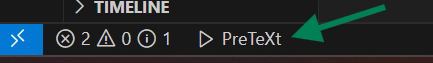

# PreTeXt commands in VS Code

There are two ways to run PreTeXt commands in VS Code: using the PreTeXt menu and using the full Command Palette.

## PreTeXt menu

Opening the PreTeXt menu gives you a choice of the most common commands used when authoring a PreTeXt document.

You can access the PreTeXt menu by clicking on the **▷PreTeXt** button in the (middle-left) of the VS Code bottom toolbar.

You can also access the PreTeXt menu with the keyboard shortcut ``Ctrl+Alt+P`` (Windows, Linux) or ``Cmd+Alt+P`` (macOS).

## Command Palette

For the complete list of available PreTeXt commands, you can use the Command Palette; open it and start typing `PreTeXt` to see all available commands.

You can access the Command Palette by pressing ``Ctrl+Shift+P`` (Windows, Linux) or ``Cmd+Shift+P`` (macOS) or by using the `View` menu and selecting `Command Palette...`.

